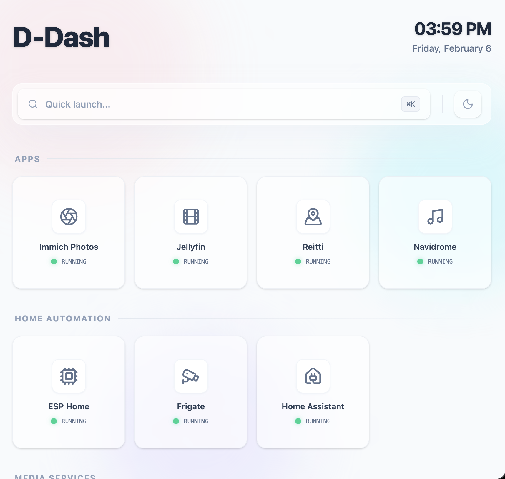

# DDash (Docker-dash)

DDash is a lightweight, self-hosted dashboard and automatic reverse-proxy manager for Docker containers. It is designed to work seamlessly with [Caddy](https://caddyserver.com/), automatically discovering containers and configuring routes based on Docker labels.

## Screenshots



## Features

- **Automatic Service Discovery**: Scans your Docker containers and automatically identifies those that should be exposed.
- **Caddy Integration**: Directly communicates with the Caddy Admin API to create and manage routes.
- **Centralized Dashboard**: Provides a clean web interface to view all your running applications, their status, and easy access via their configured routes.
- **Label-based Configuration**: Control everything through standard Docker labels—no need for complex configuration files.
- **Categorization**: Organize your apps into categories for a better overview.
- **Custom Icons**: Personalize your dashboard with custom icons for each application. Choose one
  from [Lucide](https://lucide.dev/icons/). (You have to copy the React Component name for the icon. Press the arrow
  near "Copy JSX" and choose "Copy Component Name")
- **Optional OIDC Login**: Protect start/stop/restart and log access with any OpenID Connect provider (Authelia,
  Authentik, Keycloak, Google, ...). Anonymous visitors can still see the dashboard and launch apps.
- **Clean Container Logs**: Automatically filters out ANSI escape sequences (terminal colors) from Docker logs for
  better readability in the web UI.
## How it Works

DDash connects to both the Docker socket and the Caddy Admin API. 
1. It monitors your Docker containers for specific labels.
2. When a container with `ddash.enable=true` and `ddash.route` is found, DDash checks if a corresponding route exists in Caddy.
3. If the route is missing, DDash automatically adds it to Caddy via its Admin API.
4. The web dashboard fetches the list of containers and displays them based on the `ddash` labels.

## Getting Started

### Prerequisites

- **Docker** and **Docker Compose**
- **Caddy**: Running in a container, with its **Admin API enabled** (this is usually the default, but ensure it's not disabled).
- **DNS Configuration**: A local network DNS with a **wildcard domain** (e.g., `*.local`) that resolves to your Caddy server's IP address. This allows DDash to dynamically route traffic to your containers using subdomains.

### Deployment Example

The recommended way to run DDash is as part of a Docker Compose stack where it shares the network namespace with your Caddy container.

```yaml
services:
  caddy:
    image: caddy:latest
    container_name: caddy
    restart: unless-stopped
    ports:
      - "80:80"
      - "443:443"
    volumes:
      - ./Caddyfile:/etc/caddy/Caddyfile
      - caddy_data:/data
      - caddy_config:/config

  ddash:
      image: ghcr.io/jsixface/ddash:latest
    container_name: ddash
    restart: unless-stopped
    network_mode: "service:caddy"
    environment:
      - DOCKER_SOCK=/var/run/docker.sock
      - CADDY_ADMIN_URL=http://localhost:2019
      - CADDY_AUTO_SAVE_CONFIG=true
    volumes:
      - /var/run/docker.sock:/var/run/docker.sock:ro
    # Optional: If you want to access DDash dashboard through Caddy
    labels:
      - "ddash.enable=true"
      - "ddash.name=DDash"
      - "ddash.route=dash.local" # The URL will be http://dash.local
      - "ddash.category=System"
      - "ddash.icon=LayoutGrid" # Lucide icon name

volumes:
  caddy_data:
  caddy_config:
```

## Configuration

### Environment Variables

| Variable | Description | Default |
|----------|-------------|---------|
| `DOCKER_SOCK` | Path to the Docker socket | `/var/run/docker.sock` |
| `PORT` | Port DDash listens on | `8080` |
| `LISTEN_ADDR` | Address DDash listens on | `0.0.0.0` |
| `CADDY_ADMIN_URL` | URL of the Caddy Admin API | `http://localhost:2019` |
| `CADDY_AUTO_SAVE_CONFIG` | Whether to tell Caddy to save its config after changes | `false` |
| `CADDY_SECURE_ROUTING` | Default for containers without a `ddash.https` label: if true, routes go on Caddy's `:443` server and dashboard links use `https://`, otherwise `:80` / `http://` | `false` |
| `EXTERNAL_CONFIG_PATH` | Path of the [external services](#external-services) TOML file | `/config/services.toml` |
| `OIDC_ISSUER_URL` | OIDC issuer URL; enables login together with the next two variables (see [Authentication](#authentication-oidc)) | _unset_ |
| `OIDC_CLIENT_ID` | OIDC client ID | _unset_ |
| `OIDC_REDIRECT_URI` | Externally reachable callback URL, e.g. `https://dash.example.com/auth/callback` | _unset_ |
| `OIDC_CLIENT_SECRET` | OIDC client secret (omit for public clients; PKCE is always used) | _unset_ |
| `OIDC_SCOPES` | Scopes to request | `openid profile email` |
| `OIDC_ALLOWED_USERS` | Comma-separated e-mails, usernames or subject IDs allowed to log in. Empty means every user the provider authenticates | _unset_ |
| `OIDC_SESSION_TTL_HOURS` | How long a login lasts | `24` |

Invalid values for `PORT` or the boolean variables are logged as warnings and fall back to the default.

### Authentication (OIDC)

By default DDash has **no authentication**: anyone who can reach it can start, stop and restart your containers and
read their logs. Since DDash is usually run on a home network that is fine for many setups, but you can turn on OIDC
login to lock those actions down.

| | Anonymous | Logged in |
|---|---|---|
| See the dashboard and app status | yes | yes |
| Launch apps (open their URL) | yes | yes |
| View container logs | no | yes |
| Start / stop / restart containers | no | yes |

Enable it by setting `OIDC_ISSUER_URL`, `OIDC_CLIENT_ID` and `OIDC_REDIRECT_URI` (all three are required; a partial
configuration is ignored with a warning and DDash stays open). Register DDash with your provider as a client using the
authorization-code flow and your `OIDC_REDIRECT_URI` as the redirect URI.

```yaml
  ddash:
    image: ghcr.io/jsixface/ddash:latest
    environment:
      - OIDC_ISSUER_URL=https://auth.example.com
      - OIDC_CLIENT_ID=ddash
      - OIDC_CLIENT_SECRET=change-me
      - OIDC_REDIRECT_URI=https://dash.example.com/auth/callback
      - OIDC_ALLOWED_USERS=alice@example.com   # optional
```

Details worth knowing:

- Logging in uses the authorization-code flow with PKCE. DDash reads the user's identity from the provider's userinfo
  endpoint (or the ID token if the provider has none).
- Sessions live in memory and last `OIDC_SESSION_TTL_HOURS`; restarting DDash logs everyone out. The session cookie is
  `HttpOnly` and `SameSite=Lax`, and is marked `Secure` when `OIDC_REDIRECT_URI` is `https://`.
- Only containers with `ddash.enable=true` can be controlled or have their logs read, whether or not OIDC is enabled.
- Logging out ends the DDash session only; it does not sign you out of the identity provider.
- Use `https://` for the redirect URI in anything but local testing, and keep `OIDC_ALLOWED_USERS` set if your
  provider also authenticates people who should not manage your containers.

### Docker Labels

Configure your applications by adding these labels to your containers:

| Label            | Description                                                | Required                         |
|------------------|------------------------------------------------------------|----------------------------------|
| `ddash.enable`   | Set to `true` to show in dashboard and manage routing      | Yes                              |
| `ddash.route`    | The hostname for the application (e.g., `app.example.com`) | Yes                              |
| `ddash.name`     | Display name in the dashboard                              | No (defaults to container name)  |
| `ddash.category` | Grouping category in the dashboard                         | No (defaults to "Uncategorized") |
| `ddash.icon`     | Icon name (supports Lucide icons)                          | No (defaults to "LayoutGrid")    |
| `ddash.order`    | Display order within category (integer, ascending)         | No (defaults to Int.MAX_VALUE)   |
| `ddash.port`     | The internal container port to proxy to                    | see below                        |
| `ddash.https`    | `true`/`false`: put the route on Caddy's HTTPS (`:443`) or HTTP (`:80`) server and use `https://`/`http://` links. Overrides `CADDY_SECURE_ROUTING` | No (defaults to `CADDY_SECURE_ROUTING`) |
| `ddash.url`      | Link shown on the dashboard instead of one derived from `ddash.route`. Must be `http(s)://...` (a bare host gets the scheme added); other schemes are ignored | No |
| `ddash.description` | Tooltip text on the dashboard                           | No                               |

### Network Modes

DDash handles different Docker network modes to ensure correct routing:

- **Normal Network (Bridge/User-defined)**: DDash routes to the container using its name and either the port specified
  in `ddash.port` or the first exposed port.
- **Host Network Mode (`network_mode: host`)**: DDash routes to `host.docker.internal` using the port specified in the
  `ddash.port` label. **The `ddash.port` label is required for this mode.**
- **Attached Network Mode (`network_mode: service:name`)**: DDash routes to the target
  container/service name using the port specified in the `ddash.port` label. **The `ddash.port` label is
  required for this mode.**

For both Host and Attached network modes, DDash skips automatic port discovery to avoid incorrect routing.

### Route management

DDash only adds Caddy routes; it never removes routes for containers that go away. When it processes containers
(at startup and whenever a container starts, stops, dies, is renamed or updated) it:

- adds a route for each `ddash.enable=true` container that has a `ddash.route` and none yet;
- moves a route that sits on the wrong Caddy server (per `ddash.https`) to the right one. A route that also matches
  other hosts is left in place (with a warning) rather than deleting those hosts too;
- does nothing if it cannot read Caddy's configuration, so a Caddy outage can't cause duplicate routes.

Caddy configs that use handlers or matchers DDash doesn't know about (`rewrite`, `authentication`, path matchers, ...)
are fine. If Docker or Caddy is not reachable when DDash starts, DDash keeps retrying in the background (with
increasing delays up to a minute) while the dashboard is already available. If the Docker event stream drops (for
example because Docker restarted) DDash reconnects and re-checks all containers.

### External services

To list things that are not Docker containers, create a TOML file (default `/config/services.toml`, change with
`EXTERNAL_CONFIG_PATH`) and mount it into the container:

```toml
[[services]]
name = "Router"
url = "http://192.168.1.1"
category = "Network"        # default: Uncategorized
icon = "Wifi"               # Lucide icon name, default: LayoutGrid
description = "Home router" # optional
order = 1                   # optional
```

The file is re-read on every dashboard refresh. Entries whose `url` does not start with `http://` or `https://` are
ignored.

### API errors

The dashboard's API answers `401` when a login is required, `404` for containers that don't exist or aren't managed
by DDash, and `502` when Docker can't be reached, instead of pretending an action succeeded.

## Example: Adding a new app

To add a new application (e.g., Whoami) to your dashboard and Caddy:

```yaml
services:
  whoami:
    image: traefik/whoami
    container_name: whoami
    labels:
      - "ddash.enable=true"
      - "ddash.name=Who Am I"
      - "ddash.route=whoami.local"
      - "ddash.category=Tools"
      - "ddash.icon=User"
```

Once this container starts, DDash will:
1. Detect the labels.
2. Instruct Caddy to route `whoami.local` to the `whoami` container.
3. Show "Who Am I" in the "Tools" section of your dashboard.

## License

This project is licensed under the GNU Public v3 – see the [LICENSE](LICENSE) file for details.
